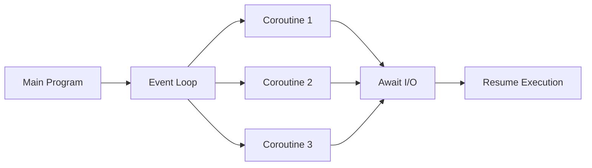
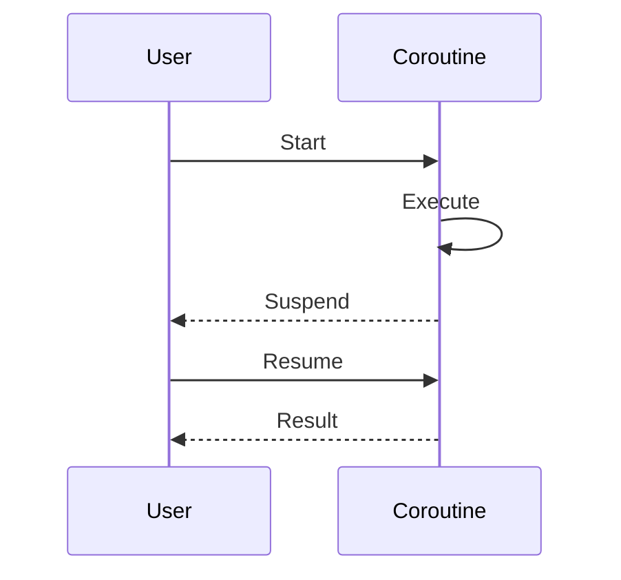
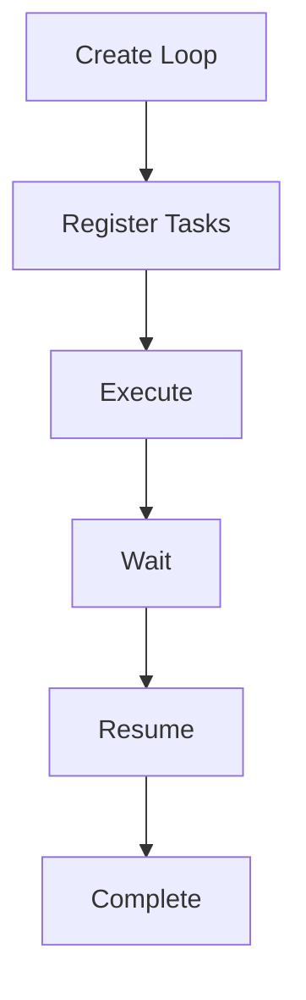
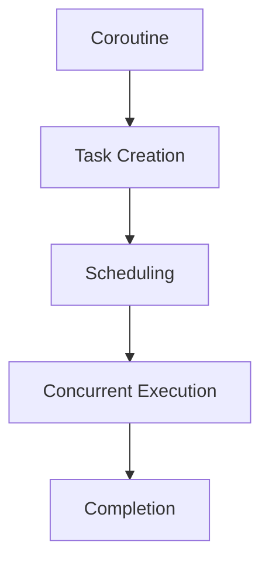
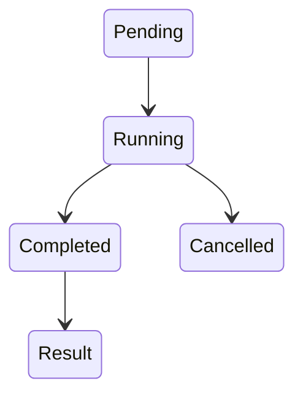
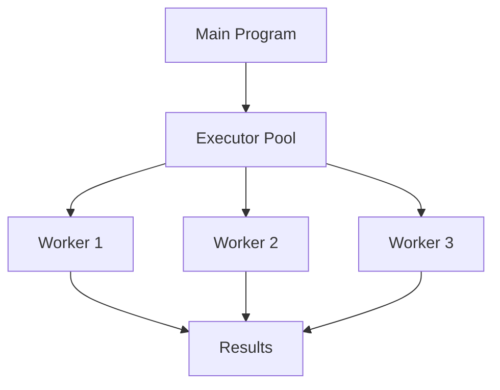
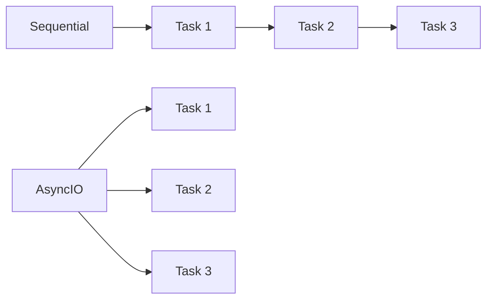

# Chapter05 - Python Parallel Programming

# 🚀 Chapter 05 – Asynchronous Programming in Python


---

## 📖 Introduction

This chapter explores Python's asynchronous programming model using **AsyncIO** and **Concurrent Futures**.

The objective is to understand how Python executes multiple operations concurrently without blocking the main program flow.

---

## 🏗 Architecture Overview



---

## 📂 Project Modules

| Module | Description |
|----------|------------|
| `asyncio_coroutine.py` | Coroutine implementation |
| `asyncio_event_loop.py` | Event loop scheduling |
| `asyncio_task_manipulation.py` | Task creation and management |
| `asyncio_and_futures.py` | Futures and callbacks |
| `concurrent_futures_pooling.py` | Thread and Process pools |

---

# 🔹 AsyncIO Coroutines

## What is a Coroutine?

A coroutine is a function that can pause its execution and later continue from the same point.

### Workflow



### Key Benefits

✅ Non-blocking execution

✅ Better responsiveness

✅ Efficient task handling

### Challenges

❌ Learning curve

❌ Debugging complexity

---

# 🔹 Event Loop

## Purpose

The Event Loop acts as the scheduler of AsyncIO.

It continuously checks pending tasks and executes them whenever resources become available.

### Lifecycle



---

# 🔹 Task Management

## Overview

Tasks wrap coroutines and allow them to run independently.

### Task Execution Model



### Advantages

- Improved concurrency
- Better task organization
- Simplified scheduling

---

# 🔹 Futures

## Overview

A Future represents a result that is not available immediately but will be produced later.

### Future State Diagram



### Features

- Result tracking
- Callback support
- Asynchronous communication

---

# 🔹 Concurrent Futures

## ThreadPool & ProcessPool

Python provides executor pools for parallel execution.

### Architecture



---

# ⚡ Execution Comparison



---

# 📊 AsyncIO vs Traditional Programming

| Feature | Traditional | AsyncIO |
|----------|------------|----------|
| Execution | Sequential | Concurrent |
| Blocking | Yes | No |
| Performance | Moderate | High |
| Scalability | Limited | Excellent |
| Resource Usage | Higher | Lower |

---

# 📊 Task vs Future

| Feature | Task | Future |
|----------|------|--------|
| Runs Coroutine | ✅ | ❌ |
| Stores Result | ✅ | ✅ |
| Awaitable | ✅ | ✅ |
| Scheduled Automatically | ✅ | ❌ |

---

# 🎯 Learning Outcomes

After completing this chapter, you will be able to:

- Understand asynchronous programming concepts.
- Create and manage coroutines.
- Work with AsyncIO event loops.
- Implement task scheduling.
- Use Future objects effectively.
- Execute workloads using ThreadPoolExecutor.
- Execute workloads using ProcessPoolExecutor.
- Compare synchronous and asynchronous execution models.

---

# 🛠 Requirements

```bash
Python 3.x
```

Verify installation:

```bash
python --version
```

---

# ▶ Running Examples

### Coroutines

```bash
python asyncio_coroutine.py
```

### Event Loop

```bash
python asyncio_event_loop.py
```

### Tasks

```bash
python asyncio_task_manipulation.py
```

### Futures

```bash
python asyncio_and_futures.py
```

### Concurrent Futures

```bash
python concurrent_futures_pooling.py
```

---

# 📝 Key Takeaways

> AsyncIO enables highly efficient asynchronous execution by allowing tasks to pause and resume without blocking the program.

> Futures provide placeholders for results that will become available later.

> Concurrent Futures simplifies multithreading and multiprocessing through executor pools.

> Event Loops act as the heart of AsyncIO and coordinate all asynchronous operations.

---

## ⭐ Conclusion

This chapter provides practical exposure to modern Python concurrency techniques and serves as a foundation for developing scalable network applications, APIs, web services, and high-performance systems.