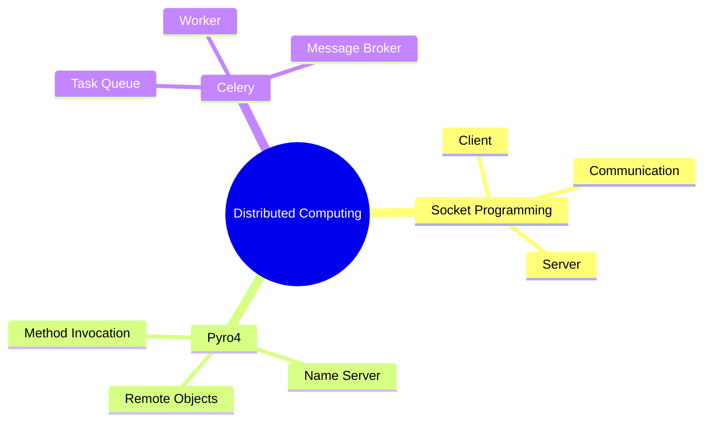
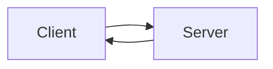
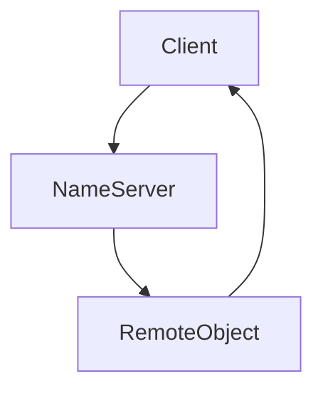
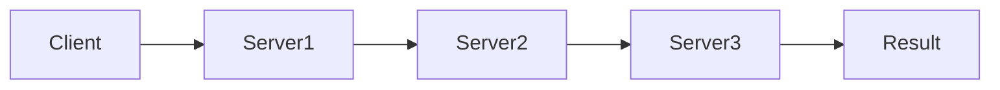
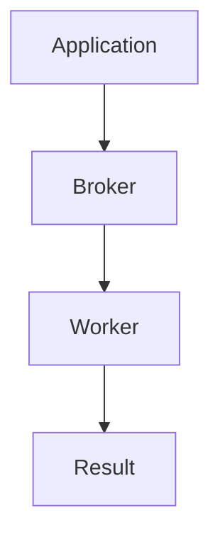
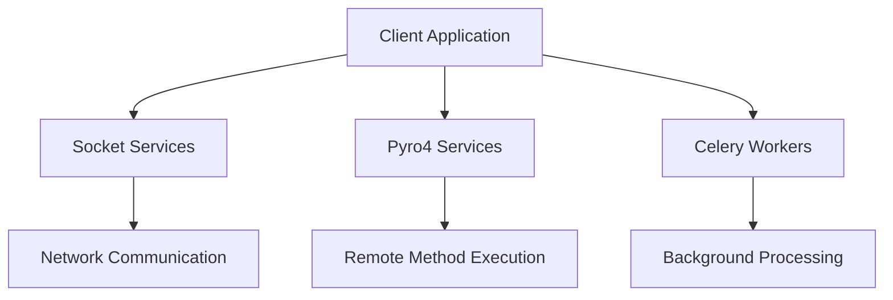

# Chapter 06s Distributed Computing and Network Communication

---

## Introduction

Distributed computing is a computing model in which multiple computers or processes work together to accomplish a common task. Communication between these components is achieved through networking technologies and distributed frameworks.

This chapter demonstrates different approaches to distributed communication and task execution using Python.

---

## Topics Covered

---

## Socket Programming

### Overview

Socket programming provides a mechanism for communication between different processes over a network. It follows a client-server architecture where one application listens for requests and another initiates communication.

### Architecture

### Working Procedure

1. Create a socket.
2. Bind the socket to an address.
3. Listen for incoming connections.
4. Accept client requests.
5. Exchange data.
6. Close the connection.

### Applications

- Chat systems
- File transfer applications
- Web services
- Network monitoring tools

---

## Pyro4 (Python Remote Objects)

### Overview

Pyro4 allows applications to invoke methods on remote Python objects as if they were local objects.

### Architecture

### Main Components

| Component | Purpose |
|------------|----------|
| Client | Sends requests |
| Name Server | Locates remote objects |
| Remote Object | Executes methods |
| Network | Transfers data |

### Benefits

- Simplifies remote communication
- Supports object-oriented design
- Easy deployment

---

## Chain Topology

### Overview

Chain topology connects multiple servers sequentially. Each server processes information and passes it to the next server.

### Structure

### Characteristics

- Sequential processing
- Distributed execution
- Modular architecture

---

## Celery

### Overview

Celery is a distributed task queue that enables background processing and asynchronous task execution.

### Architecture

### Components

| Component | Description |
|------------|-------------|
| Application | Generates tasks |
| Broker | Stores messages |
| Worker | Executes tasks |
| Result Backend | Stores outcomes |

### Common Use Cases

- Email processing
- Background jobs
- Scheduled tasks
- Data processing

---

## Comparative Analysis

| Feature | Socket Programming | Pyro4 | Celery |
|----------|------------------|--------|---------|
| Communication Level | Low-Level | Object-Level | Task-Level |
| Complexity | High | Medium | Medium |
| Scalability | Moderate | Good | Excellent |
| Background Processing | No | Limited | Yes |
| Distributed Support | Yes | Yes | Yes |

---

## Overall Distributed Architecture

---

## Learning Objectives

After completing this chapter, students should be able to:

- Understand distributed computing concepts.
- Implement client-server communication.
- Use sockets for network programming.
- Develop remote object systems using Pyro4.
- Execute distributed tasks using Celery.
- Design scalable distributed architectures.

---

## Conclusion

This chapter introduces fundamental distributed computing techniques in Python. Through Socket Programming, Pyro4, and Celery, students gain practical experience in communication, remote execution, and asynchronous task processing. These concepts form the foundation of modern distributed systems and cloud-based applications.
