# Chapter 07 Docker Containerization of Python Applications

---

## Overview

Containerization is the process of packaging an application along with its dependencies, libraries, and runtime environment into a single portable unit called a container.

This chapter demonstrates how a Python Flask application can be packaged and deployed using Docker.

---

## Concept Map

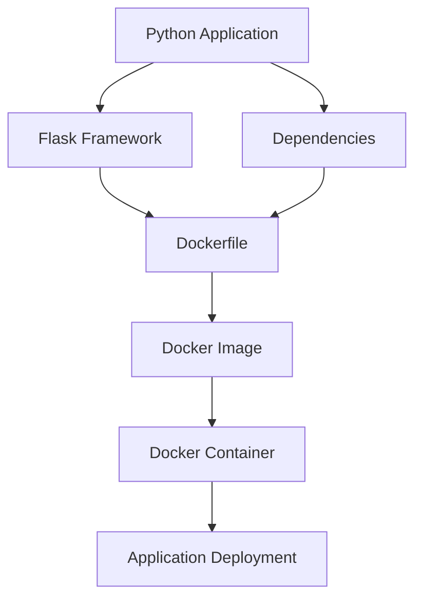

---

# Containerization Workflow

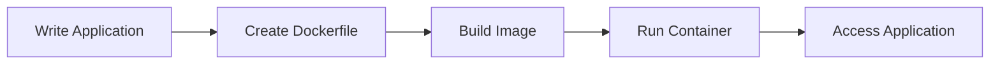

---

# Understanding the Project

The project consists of three major components:

| Component | Purpose |
|------------|-----------|
| Flask Application | Handles web requests |
| Requirements File | Stores dependencies |
| Dockerfile | Creates Docker image |

---

# Application Layer

## Flask Application

The Flask application provides a simple web service.

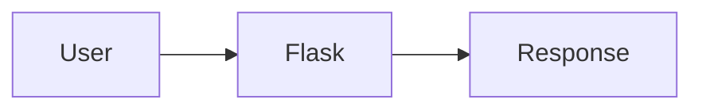

### Request Handling Process

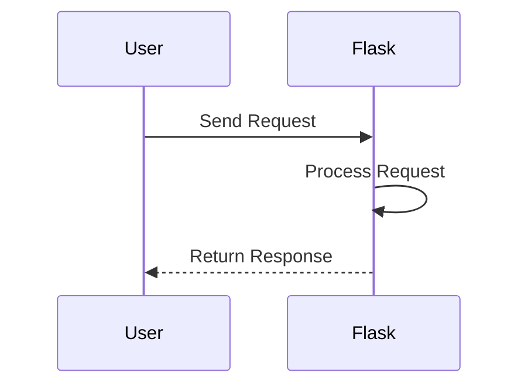

---

# Docker Layer

## Dockerfile Architecture

A Dockerfile acts as a blueprint for building Docker images.

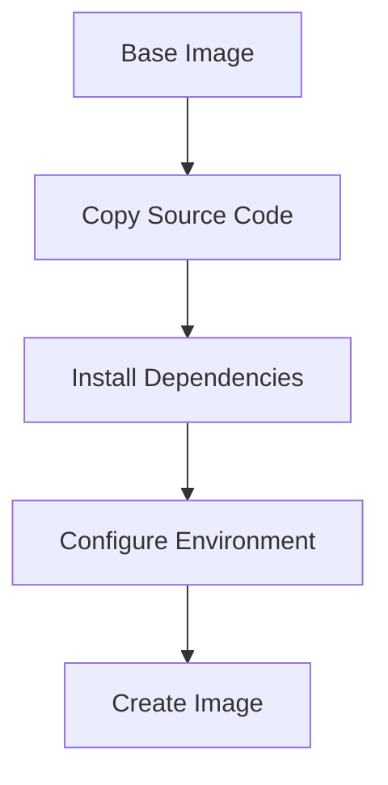

---

## Image Creation Process

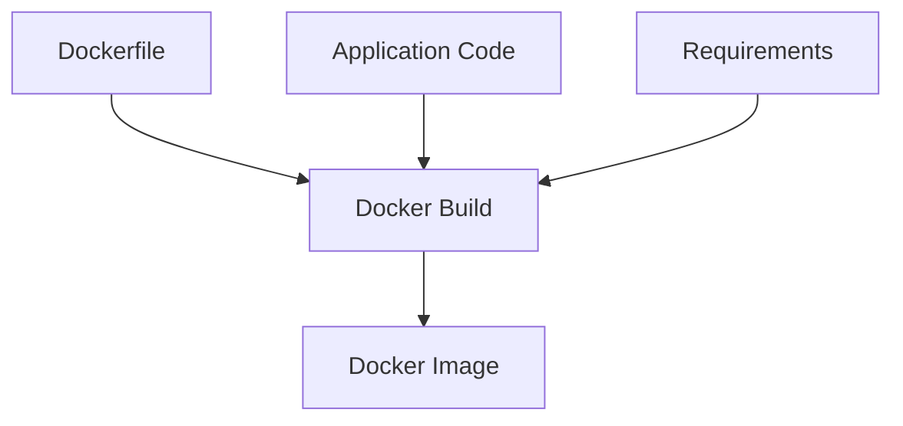

---

# Container Layer

## Container Execution

When the image is executed, Docker creates a running container.

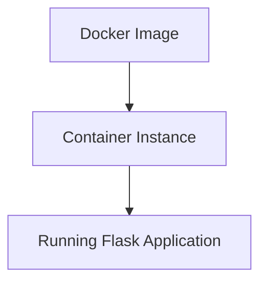

---

# Docker Lifecycle

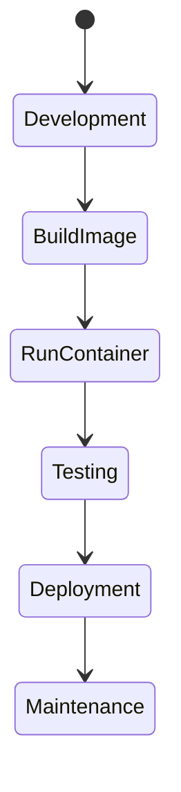

---

# Docker Components

## Dockerfile

Contains instructions required to create an image.

### Responsibilities

- Define base image
- Copy project files
- Install dependencies
- Configure startup commands

---

## Docker Image

A read-only package that contains:

- Source code
- Dependencies
- Libraries
- Runtime environment

---

## Docker Container

A running instance of an image.

Characteristics:

- Lightweight
- Portable
- Isolated
- Easy to deploy

---

# Deployment Architecture

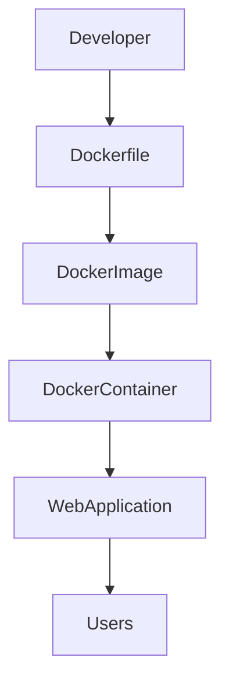

---

# Build and Deployment Process

## Build Image

```bash
docker build -t python-app .
```

## Run Container

```bash
docker run -p 5000:5000 python-app
```

## Verify Running Containers

```bash
docker ps
```

---

# Containerization Benefits

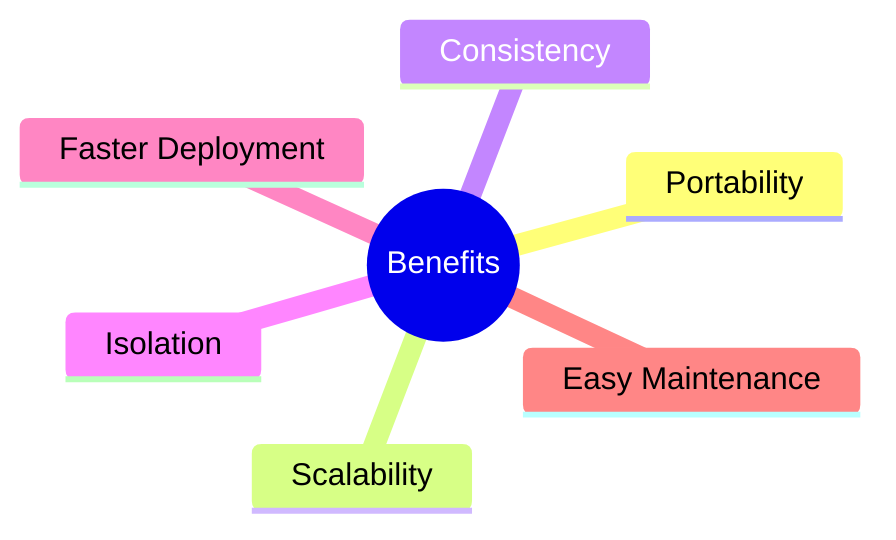

---

# Challenges

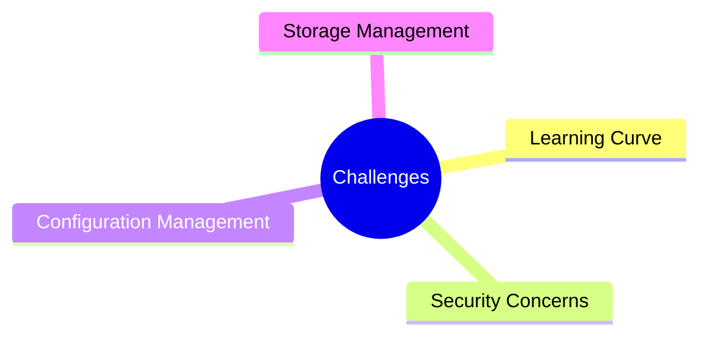

---

# Docker vs Traditional Deployment

| Feature | Traditional Deployment | Docker Deployment |
|----------|----------------------|------------------|
| Environment Consistency | Low | High |
| Portability | Limited | Excellent |
| Setup Time | High | Low |
| Resource Usage | High | Low |
| Scalability | Moderate | High |

---

# Real-World Applications

Docker is widely used in:

- Cloud Computing
- Microservices
- DevOps Pipelines
- Continuous Integration
- Continuous Deployment
- Web Application Hosting

---

# Learning Outcomes

After completing this chapter, students will be able to:

- Explain containerization concepts.
- Understand Docker architecture.
- Create Dockerfiles.
- Build Docker images.
- Execute Docker containers.
- Deploy Python Flask applications using Docker.
- Understand modern deployment practices.

---

# Summary

This chapter introduces Docker-based containerization for Python applications. By packaging source code, dependencies, and runtime configurations into a Docker image, applications become portable, scalable, and easier to deploy. Containerization has become a fundamental technology in modern software development, cloud computing, and DevOps environments.